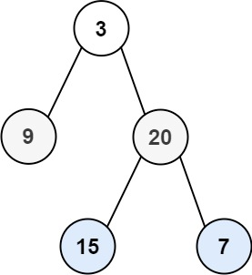

# 二叉树按层遍历/求解二叉树高度
## 描述
给你二叉树的根节点 root ，返回其节点值的 层序遍历 。 （即逐层地，从左到右访问所有节点）。



示例 1：

```
输入：root = [3,9,20,null,null,15,7]
输出：[[3],[9,20],[15,7]]
```
示例 2：
```
输入：root = [1]
输出：[[1]]
```
示例 3：
```
输入：root = []
输出：[]
```

## 解决步骤

1. 使用队列实现
2. 初始阶段将 root 节点添加到队列中
3. 当队列不为空时循环处理，每次进入则表示迭代一个层，每迭代一个层时将下一层的左右节点加入队列中
4. 迭代层的过程中将节点值放入 List 中，迭代结束将 List 添加到结果集中即可
5. 关键点：层中节点总个数等于当前队列大小
2. 二叉树的高度：从下到上，从0开始，二叉树深度：从上到下，从0开始，二叉树层数：从上到下，从1开始
3. 二叉树高度= 层数 -1 深度同高度


## 编码实现
```java
/**
 * Definition for a binary tree node.
 * public class TreeNode {
 * int val;
 * TreeNode left;
 * TreeNode right;
 * TreeNode() {}
 * TreeNode(int val) { this.val = val; }
 * TreeNode(int val, TreeNode left, TreeNode right) {
 * this.val = val;
 * this.left = left;
 * this.right = right;
 * }
 * }
 */
class Solution {
    public List<List<Integer>> levelOrder(TreeNode root) {
        List<List<Integer>> res = new ArrayList<>();
        if (root == null) {
            return res;
        }
        Queue<TreeNode> queue = new LinkedList<>();
        queue.offer(root);
        while (!queue.isEmpty()) {
            // 此处可统计层数
            int size = queue.size();
            List<Integer> list = new ArrayList<>();
            for (int i = 0; i < size; i++) {
                TreeNode node = queue.poll();
                list.add(node.val);
                if (node.left != null) {
                    queue.offer(node.left);
                }
                if (node.right != null) {
                    queue.offer(node.right);
                }
            }
            res.add(list);
        }
        return res;
    }
}
```
