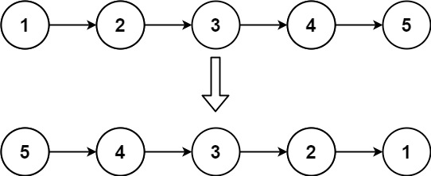
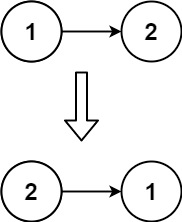

# 单链表反转
## 描述
给你单链表的头节点 head ，请你反转链表，并返回反转后的链表。


示例 1：



```
输入：head = [1,2,3,4,5]
输出：[5,4,3,2,1]
```

示例 2：



```
输入：head = [1,2]
输出：[2,1]
```
示例 3：
```
输入：head = []
输出：[]
```

## 解决步骤

1. 先判空，若空则不处理，直接返回
2. 定义一个 prev 节点，值为 null，供第一个节点指向，同时也是反转后的最后一个节点
3. 循环 head 节点
4. 提前存储 head 的 next 节点，避免丢失，反转 head 的 next 指向，更新 prev，更新 head
5. 返回 prev 节点即可，此时的 prev 即为头节点


## 编码实现
```java
/**
 * Definition for singly-linked list.
 * public class ListNode {
 * int val;
 * ListNode next;
 * ListNode() {}
 * ListNode(int val) { this.val = val; }
 * ListNode(int val, ListNode next) { this.val = val; this.next = next; }
 * }
 */
class Solution {
    public ListNode reverseList(ListNode head) {
        if (head == null) {
            return head;
        }
        ListNode prev = null;
        while (head != null) {
            ListNode next = head.next;
            head.next = prev;
            prev = head;
            head = next;
        }
        return prev;
    }
}
```
